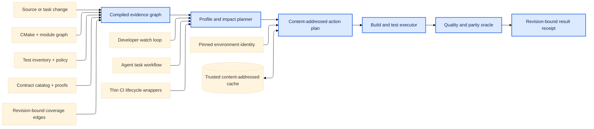
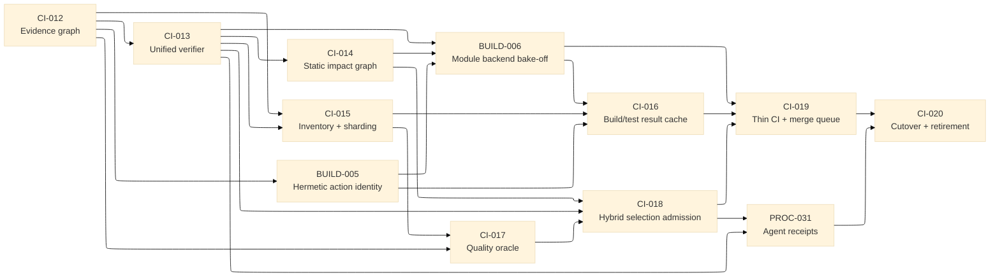

# Verification evidence architecture (planned)

Status: `roadmap` — this document binds the target design and migration tasks.
It does not describe the current CI implementation as already operational.

## Outcome

IntrinsicEngine should have one deterministic verification system for local
editing, pull requests, merge groups, scheduled deep checks, and agent task
completion. It should minimize the time to the first useful failure and the
total amount of work executed while preserving the logical test inventory,
contract proofs, sanitizer coverage, capability evidence, and source-coverage
evidence.

The design is based on one rule: **work may be omitted only when the system can
prove that an equivalent result already exists or that the work is outside the
change's admitted impact closure**. Parallel execution improves wall time but
does not count as a reduction in total work.

## Scope and non-goals

This roadmap owns test registration and execution policy, build/test action
identity, affected-scope planning, CI lifecycle routing, and agent verification
receipts. It does not change engine-layer ownership, production algorithms, or
method correctness contracts.

The migration does not:

- replace GoogleTest assertions or require a second test-authoring DSL;
- treat source coverage alone as evidence that assertions are strong;
- cache raw build directories or compiler module files across unidentified
  toolchain, path, or dependency contexts;
- make GPU, timing, global-state, concurrency, or stochastic tests cacheable by
  default;
- let an agent, PR, or workflow lower the evidence profile selected by policy;
- delete the existing gates until their replacements pass matched shadow
  admission.

## Evidence retained from the current system

The redesign must consume rather than discard the proof surfaces established
by the current repository:

- configured producer/source/aggregate inventories and exact GoogleTest/CTest
  reconciliation in [`test-strategy.md`](test-strategy.md);
- fail-closed affected-scope planning in
  [`tools/ci/touched_scope.py`](../../tools/ci/touched_scope.py);
- isolated unsanitized, ASan, UBSan, Release, and promoted-Vulkan identities in
  [`CMakePresets.json`](../../CMakePresets.json);
- replacement-only grouping and explicit worker reservations documented by
  [`CI-008`](../../tasks/done/CI-008-grouped-ctest-and-worker-oversubscription.md);
- complete CPU source and branch-arm parity in
  [`tools/ci/source_coverage.py`](../../tools/ci/source_coverage.py);
- stable result/timing artifacts and lifecycle routing documented by
  [`ci-policy.md`](../benchmarking/ci-policy.md);
- task contracts, claims, fixed-surface review, and experiment custody defined
  by [`workflow-evidence.md`](../agent/workflow-evidence.md).

These remain independent evidence classes. A passing unsanitized run does not
stand in for a sanitizer or Vulkan result, and a cache hit does not become a
new execution.

## Architectural invariants

1. **One compiled evidence graph.** Every plan is a projection of one
   schema-versioned graph, not an independent interpretation of labels, paths,
   shell fragments, or task prose.
2. **Derived facts stay derived.** CMake codemodel data, compiler module
   dependencies, CTest/GoogleTest inventories, coverage edges, and contract
   proofs are compiled into the graph. Only facts that cannot be derived—such
   as isolation, resource, and cacheability policy—are declared once at the
   owning registration site.
3. **Unknown means broader.** Missing diffs, incomplete graphs, unknown files,
   stale coverage identities, or ambiguous capabilities select a bounded broad
   plan or fail. They never produce an empty successful plan.
4. **Exact equivalence is the cache boundary.** An action or test result is
   reusable only when all inputs that can affect it are in its digest.
5. **Logical cases remain visible.** Sharding or grouping may reduce process
   launches, but results, seeds, diagnostics, and reproduction commands remain
   addressable per logical test case.
6. **Selection is admitted, not assumed.** A selective PR plan becomes
   authoritative only after matched full-suite shadowing reports no unexplained
   misses, lost regions or branch arms, lost contract proofs, mutation-score
   regression, capability loss, or flake increase.
7. **Full confidence moves to the merge batch.** The merge-group profile runs
   every required CPU/sanitizer/capability class once for the candidate batch.
   Scheduled deep checks own stress, fuzzing, mutation breadth, complete source
   coverage, benchmarks, and vendor/driver matrices.
8. **Receipts bind the final surface.** A task or agent result is valid only for
   the exact diff, graph, plan, toolchain/environment, test inventory, inputs,
   seeds, and result artifacts recorded by the receipt.

## Target data flow

Question: how does one source change become the same reviewable evidence in a
developer loop, an agent session, and hosted CI?

Notation: arrows mean “provides data to or invokes”; the cache arrow is
bidirectional because an authorized execution may read or publish an exact
result. This is a data-flow view, not a C++ module dependency graph.

The durable graph is plain schema-versioned data. The verifier is one process
using plain records and functions; it is not a resident service, plugin system,
or registry framework.

## Evidence graph

The graph must carry these identities and edges:

| Record | Required identity | Important edges |
| --- | --- | --- |
| Source/build input | repository path, content digest, source revision | owning target, generated inputs, contracts |
| Build target/action | command, declared inputs, toolchain/sysroot/environment digest | dependencies, reverse dependents, produced executables |
| Contract | stable catalog ID and canonical source/proof digests | affected sources, proof tests/validators |
| Logical test case | producer digest, stable case ID, data/config/seed identity | source-coverage edges, contracts, capability, resource policy |
| Variant | preset/backend/sanitizer/build-mode identity | build actions, eligible tests, required lifecycle profiles |
| Result | action/test key, status, duration, diagnostics/artifact digests | exact graph, plan, revision, runner identity |

The generated graph lives under the configured build/evidence directory and is
never hand-edited. CTest labels, aggregate targets, workflow matrices, and
human-readable plans are projections. During migration they are compared with
the current authorities; after cutover they remain compatibility and IDE
surfaces rather than independent routing policy.

## Verification profiles

The latency values below are program targets, not statements about current
performance. `CI-012`, `BUILD-006`, and `CI-018` must bind final admission
thresholds to comparable evidence before any target is claimed as met.

| Profile | Required work | Target feedback budget |
| --- | --- | --- |
| `edit` | structural checks, affected build actions, direct/contract tests, cheap sentinels; watch and reuse exact local results | implementation-unit first result p95 at most 10 s; module-interface p95 at most 60 s |
| `pr` | admitted static-impact union coverage-impact union contract proofs union risk sentinels; affected capabilities; fail-closed broad fallback | focused p95 at most 3 min; broad p95 at most 8 min |
| `merge` | full required unsanitized CPU, ASan, UBSan, promoted Vulkan, Release/SLO, and cheap slow correctness once per merge group | candidate p95 at most 10 min |
| `deep` | complete coverage, stress, fuzzing, mutation breadth, full slow cohort, benchmarks, and vendor/driver matrices | scheduled; budgets declared per workload |

Within one profile, a cacheable logical case/variant/input identity executes at
most once. An intentional multi-seed or cache-audit repetition is separately
identified and counted. Every report separates wall time, executed action
seconds, cache-hit savings, CPU minutes, and GPU minutes; retries are visible
and never rewrite the original failure.

The program target for a matched accepted-change corpus is at least a 50%
reduction in executed action-seconds versus the current topology, with no
quality-admission regression. This target can be refuted or revised by the
claim-grade bake-off; it is not permission to weaken a gate.

## Test execution and cache policy

- Prefer one executable per cohesive dependency/runtime domain, then shard its
  logical cases with duration-balanced deterministic filters. Do not create one
  executable per source file.
- Cache case inventories by executable digest. Normal execution must not launch
  every binary merely to rediscover unchanged case names.
- Pure cases may share a process shard. Death tests and tests using mutable
  process-global state, scheduler pools, environment mutation, real files,
  windowing, RHI/Vulkan, timing thresholds, or stochastic inputs remain
  isolated unless a reset/hermeticity audit proves otherwise.
- A test-result key includes executable, runtime data, config, environment,
  seed, capability, and relevant resource identity. Omitted or unknown inputs
  make the result non-cacheable.
- Untrusted PRs and developer/agent worktrees may read verified shared entries
  but cannot publish trusted entries. Protected CI is the trusted writer.
- A random protected re-execution sample audits cache hits. Corrupt, missing,
  mismatched, or unauthorized entries are rejected and executed normally.
- Raw CMake/Ninja build trees and path-coupled BMIs are never shared as cache
  entries. Only hermetic actions/artifacts selected by `BUILD-006` may be
  reused.

## Quality admission

Every optimization that can omit or reuse work is evaluated against a matched
control:

| Dimension | Blocking admission rule |
| --- | --- |
| Inventory | exact logical case and required variant/capability set; additions are explicit, losses block |
| Results | pass/skip/fail/error parity per logical case; no opaque grouped-only result |
| Contracts | every affected stable contract schedules all catalog proofs |
| Source coverage | no previously covered production region or branch arm is lost under identical product identity |
| Assertion strength | no mutation-score regression in the declared scope; deterministic seeded faults must be killed |
| Selection | zero unexplained cases where the full control fails and the selected plan passes |
| Cache | shadow re-execution agrees exactly; corrupt/poisoned/stale entries cannot be accepted |
| Capabilities | required non-skipped Vulkan and sanitizer evidence remains distinct and present |
| Reliability | no increase in unexplained flake, retry, timeout, or quarantine rates |
| Performance | predeclared latency and executed-work thresholds pass on comparable samples |

Coverage and mutation results are complementary. Coverage proves reach;
mutations and seeded faults test whether the selected assertions observe
meaningful failures. Neither substitutes for contract- or backend-specific
evidence.

## Bound task graph

This is the authoritative dependency view for the redesign. `A --> B` means
task A must retire before task B can begin; independent branches are intended
to run in separate claimed worktrees.

| Task | Capability delivered | Admission boundary |
| --- | --- | --- |
| [`CI-012`](../../tasks/backlog/process/CI-012-versioned-verification-evidence-graph.md) | versioned compiled evidence graph and legacy parity oracle | no routing changes |
| [`CI-013`](../../tasks/backlog/process/CI-013-unified-verifier-profiles-and-receipts.md) | one plan/run entrypoint with `edit`/`pr`/`merge`/`deep` receipts | shadow only |
| [`CI-014`](../../tasks/backlog/process/CI-014-static-build-contract-impact-graph.md) | source/module/target reverse closure plus contract proofs | unknown inputs broaden |
| [`CI-015`](../../tasks/backlog/process/CI-015-digest-test-inventory-and-sharding.md) | digest-keyed case inventory, isolation policy, deterministic shards | logical parity required |
| [`BUILD-005`](../../tasks/backlog/process/BUILD-005-hermetic-toolchain-action-identity.md) | pinned environment/action identity and trusted-writer policy | no raw-tree reuse |
| [`BUILD-006`](../../tasks/backlog/process/BUILD-006-cxx23-module-build-backend-bakeoff.md) | evidence-backed module build/cache backend decision | claim-grade matched bake-off |
| [`CI-016`](../../tasks/backlog/process/CI-016-content-addressed-build-test-result-cache.md) | exact build/test reuse with poisoning and shadow audits | cache is an optimization only |
| [`CI-017`](../../tasks/backlog/process/CI-017-test-quality-and-fault-detection-oracle.md) | coverage, mutation/fault, reliability, and capability quality oracle | deep lane remains complete |
| [`CI-018`](../../tasks/backlog/process/CI-018-hybrid-impact-selection-admission.md) | static/coverage/contract/sentinel union and selection-miss proof | PR omission disabled until admitted |
| [`CI-019`](../../tasks/backlog/process/CI-019-thin-ci-merge-queue-topology.md) | thin workflows, build-once variants, merge batching, stable results | protected-settings proof required |
| [`PROC-031`](../../tasks/backlog/process/PROC-031-agent-verification-receipts.md) | watch loop and final-diff agent/task receipt integration | agents cannot downgrade evidence |
| [`CI-020`](../../tasks/backlog/process/CI-020-verification-cutover-and-legacy-retirement.md) | authoritative cutover, soak, rollback proof, and legacy deletion | all predecessors plus final shadow parity |

## Migration and deletion sequence

1. **Compile and compare.** `CI-012..015` build adapters over the current
   CMake/CTest/coverage surfaces. Current workflows stay authoritative.
2. **Make reuse safe.** `BUILD-005..006` select a hermetic module-safe action
   model; `CI-016` admits exact result reuse. Cache misses still execute the
   ordinary plan.
3. **Prove quality.** `CI-017..018` freeze and run the matched quality/selection
   protocols. Until admission, PR plans shadow the current full gates.
4. **Move lifecycle authority.** `CI-019` makes workflows thin and runs the
   complete required matrix once per merge batch. `PROC-031` binds local and
   agent completion to the same plan/receipt contract.
5. **Delete duplicate policy.** `CI-020` removes hand-maintained path routing,
   labels as primary policy, ordinary PRE_TEST rediscovery, duplicated workflow
   commands, repeated toolchain setup, and obsolete grouping/timing adapters
   only after a predeclared soak and exact rollback exercise.

The rollback unit is the verifier/profile version plus its environment and
graph schema, not an unversioned build directory. A failed admission or soak
returns authority to the last accepted version while retaining the failed
receipt for diagnosis.

## Right-sizing decisions

- One verifier is justified by four present consumers: developer, agent, PR,
  and merge/deep CI. Separate policy engines are forbidden.
- The evidence graph is a generated plain record set. A database, resident
  coordinator, extension framework, or custom scheduler requires a new task
  with a present need and deletion-test justification.
- GoogleTest remains the assertion framework and CTest remains an adapter for
  IDE/local compatibility. New work improves discovery/execution planning
  rather than rewriting tests into a proprietary format.
- `BUILD-006` must compare the conservative CMake/Ninja path with any remote
  action candidate. The roadmap does not preselect REAPI, Bazel, or another
  backend before named-module invalidation and developer-tooling evidence.
- Compatibility code is time-bounded to `CI-020`; no dual authority survives
  final retirement.

## Evidence and blind spots

Authoritative planning evidence comes from [`AGENTS.md`](../../AGENTS.md),
[`test-strategy.md`](test-strategy.md),
[`ci-policy.md`](../benchmarking/ci-policy.md), the retired `CI-003..011` and
`BUILD-004` task evidence, the current CMake/test tooling under
[`cmake/`](../../cmake/) and [`tools/ci/`](../../tools/ci/), and the workflow
definitions under [`.github/workflows/`](../../.github/workflows/).

This roadmap does not prove that a remote execution service is available, that
all current tests are hermetic, or that the target latency budgets are already
reachable. `BUILD-006`, `CI-016`, `CI-017`, and `CI-018` are explicit killing
gates for those assumptions.
