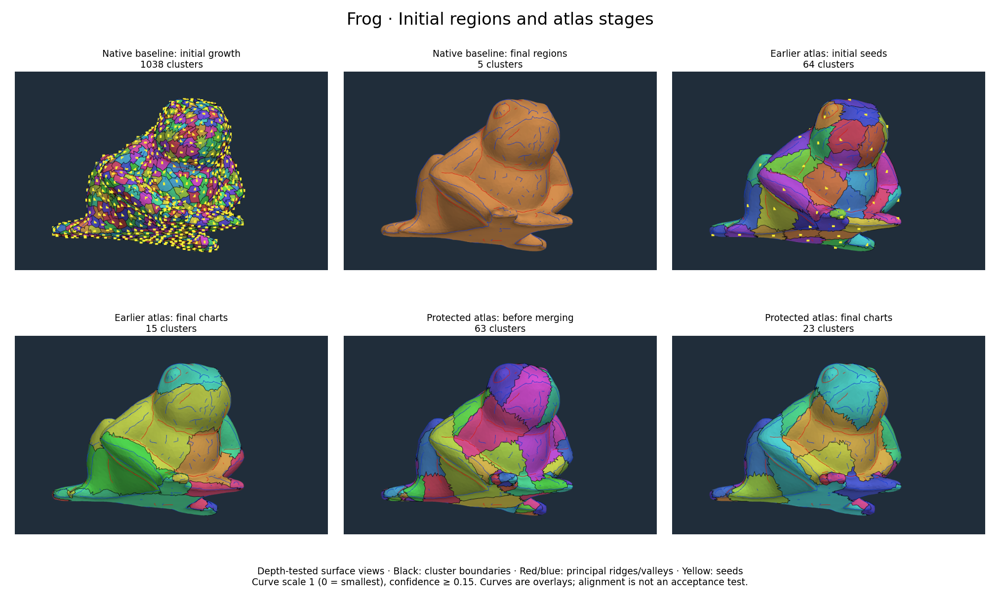
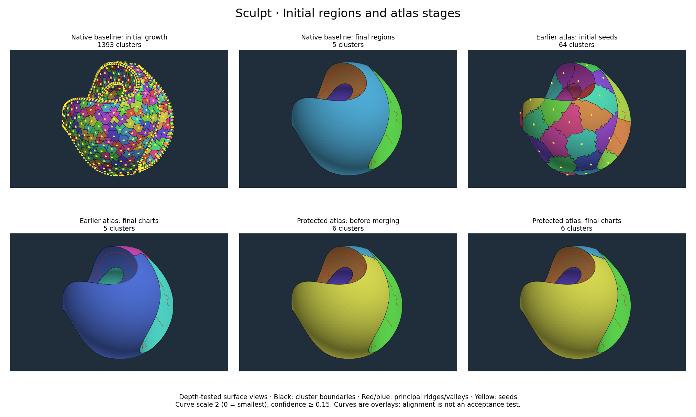
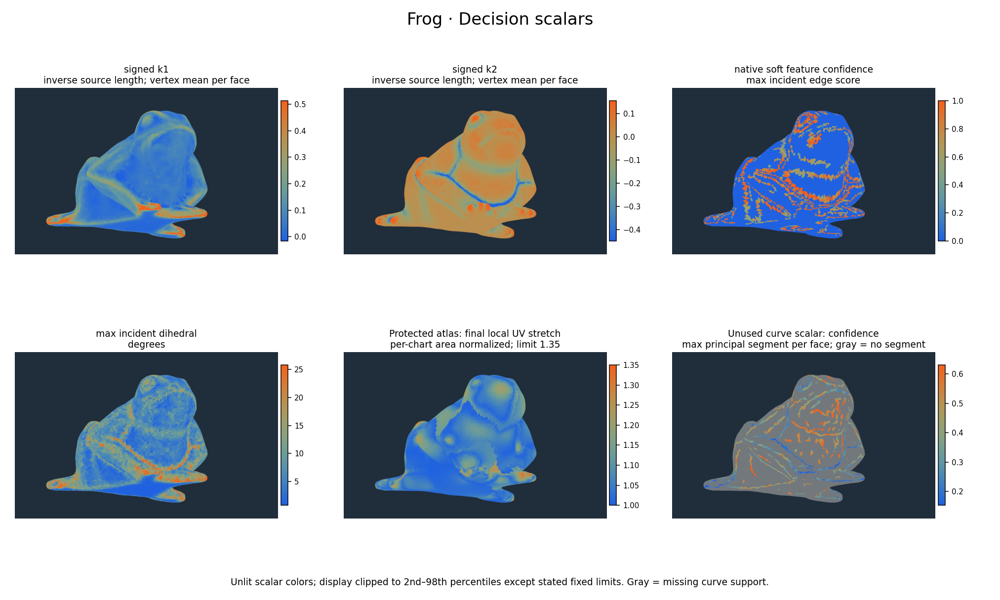

# Atlas stages, curvature evidence and merge decisions

The 2026-09-08 audit answers the operator's questions about intermediate clusters,
curvature alignment, merge criteria and seed movement. Before this audit we had
not visualized every atlas partition change, and the atlas decisions did not use
the available curvature-extremum curves. The new trace observes existing decisions;
it does not change growth, splitting, merging or their parameters.

The [stage record](../../ara/evidence/diagnostics/method045/stages/record.json)
and [C73](../../ara/logic/claims.md#c73-atlas-boundary-loss-occurs-at-different-stages)
bind the local CPU findings. The original
[baseline-preserving experiment](baseline_preserving_atlas_experiment.md) remains
unchanged. These are source-bound local diagnostics, not publication-grade results.

## What can now be inspected

The standalone viewer generated at `build/method045-stage-audit-final/index.html`
has 265 stage/scalar views across frog and sculpt, synchronized orbit/zoom,
previous/next buttons, initial seed markers, principal/mean curve overlays,
support-scale and confidence/strength/agreement filters, and scalar colors.

It records every accepted Python atlas partition split and merge, and each
attempted union's status and available numerical values. It includes native
baseline initial/final regions and existing native merge-energy records.
**It does not reconstruct every native refinement state**, nor show every solver
iteration or internal UV-cut construction. Native merge records interleave face
refinements without a common event order. A curve overlay is not a quantified
alignment test. Final-stage colors identify UV charts; internal cuts within one
chart are separate from those colored borders.





These figures use depth-tested WebGL captures so hidden curves do not appear
through the surface. Curve scale is medium for frog and large for sculpt;
confidence cutoff 0.15 is display-only. The viewer exposes other scales and
filters. These choices are not anatomical ground truth or tuned decision limits.

## Three distinct pipelines

| Pipeline | Initial regions | Merge decisions | Boundary movement |
| --- | --- | --- | --- |
| Native baseline | Hard-blocked graph growth using curvature descriptors and soft-feature confidence; 1038 frog / 1393 sculpt seeds in these runs | Requires decreased energy: curvature-mixture fit and region complexity plus boundary length, turning and feature support; hard borders block merges | Local face reassignment/refinement; 12 accepted frog moves, 0 sculpt moves |
| Earlier feature atlas | 64 farthest-point face seeds; graph distance plus unsigned dihedral penalty | Curvature affects priority only; any topologically/numerically admissible union is accepted | No seed relocation or boundary refinement |
| Protected atlas | Original native region components; open with cuts, split rejected charts | Same-original-region restriction; shared-border priority and fresh cut/UV validity checks | No relocation/refinement; source-region borders fixed |

Native baseline complexity cost is the existing local diagnostic value 0.5.
Native fields originate in
[CurvatureSegmentation.Patches](../../src/geometry/Geometry.HalfedgeMesh.CurvatureSegmentation.Patches.cpp),
not in the Python atlas. Native curvature-mixture components also differ from
spatial regions: identical curvature descriptors can occur on distant parts.

In [the earlier atlas](../../tools/diagnostics/atlas/patch_merge.py), seeds start
at the largest triangle and then at farthest graph-distance faces. Seed selection
uses distances without the dihedral penalty. Growth then uses
`centroid_distance + 2 * (1/sqrt(64)) * unsigned_dihedral_angle` per dual edge.
This discourages crossing face-normal changes; it does not follow extracted
curvature-extremum lines or enforce native hard barriers.

For adjacent charts A and B, the earlier merge priority is

`shared_length / sqrt(min(area_A, area_B)) / (1 + 2 * mean_dihedral)`.

Mean dihedral is shared-edge-length weighted and measured in radians. Larger
scores are attempted first. The
[protected atlas](../../tools/diagnostics/atlas/baseline_atlas.py) omits the last
factor and considers only pairs from the same original region.

Both construct a fresh LSCM map of the union and require valid disk topology
(after explicit cuts in the protected arm), finite positive triangle orientation,
a simple non-self-intersecting boundary, maximum bidirectional stretch at most
1.35 and anisotropy at most 2. Stretch is per-chart area normalized, excluding
between-chart density variation. The later packer has a separate post-pack audit.
**Neither merge requires distortion to improve**, compares boundary quality
before/after, or optimizes packing occupancy in its acceptance decision.

## Where boundaries disappear

Counts recomputed independently from saved stage labels:

| Earlier atlas stage | Frog: lost out of 55 baseline edges | Sculpt: lost out of 384 |
| --- | ---: | ---: |
| Raw 64-cluster growth | 44 | 5 |
| After initial UV validation/subdivision | 41 | 5 |
| After merging | 41 | 63 |

The event trace identifies all 58 additional sculpt losses during merging as
native hard-feature edges. Frog loses its remaining baseline borders before
merging; a merge veto alone cannot restore them. Initial subdivision happens
to reintroduce three frog baseline edges; it does not optimize their recovery.

| Atlas arm | Frog merges accepted / attempted | Sculpt merges accepted / attempted |
| --- | ---: | ---: |
| Earlier feature | 58 / 155; 73 → 15 charts | 59 / 93; 64 → 5 charts |
| Protected | 40 / 149; 63 → 23 charts | 0 / 1; 6 → 6 charts |

The protected arm loses no baseline edge. Its frog merges nevertheless remove
64 other edges with nonzero native soft-feature evidence. That is a diagnostic
fact, **not proof of destroying 64 good anatomical boundaries**. These scores
are neither probabilities nor an established ground-truth partition.
The [saved-array reconciliation](../../ara/evidence/diagnostics/method045/stages/boundary-reconciliation.json)
and per-mesh decision JSON retain the distinction.

## Available scalars and whether decisions use them



[Sculpt scalar fields](../../ara/evidence/diagnostics/method045/stages/sculpt-scalars.png)
use the same definitions. Scalars are unlit; display ranges are clipped to the
2nd–98th percentiles except fixed confidence/stretch limits. Gray indicates no
curve segment in that face, not zero confidence.

| Signal | Native baseline | Earlier atlas | Protected atlas |
| --- | --- | --- | --- |
| Signed k1/k2 and curvature-mixture fit | Growth/region objective | Unused | Only inherited through original labels |
| Native hard barriers | Growth and merge constraints | Unused | Preserved when represented by original borders |
| Native soft confidence | Growth and boundary energy | Unused | Only inherited through original labels |
| Unsigned dihedral angle | Contributes to upstream hard-feature detection | Growth cost and merge priority | No angle term in additional cuts, splits or merges |
| Principal/mean extrema curves | Separate METHOD-041 detector | Unused | Unused |
| Curve confidence, strength, sharpness, fit residual, scale agreement | Detached detector diagnostics | Unused | Unused |
| UV stretch/anisotropy, orientation, topology | No UV test | Union admissibility and explicit subdivision | Union admissibility and explicit subdivision |
| Boundary turning/smoothness | Native objective/refinement | Unused | Unused for added UV borders |
| Packing utilization | No atlas | Measured afterward | Measured afterward |

The viewer adds growth-distance, signed-curvature, dihedral, soft-confidence,
local UV-stretch and curve-score maps. The event JSON includes candidate priority,
shared-border length/mean angle, removed evidence counts, rejection reason and
maximum stretch/anisotropy when the solver reached that stage. Topology failures
have no invented UV metric. The native stage JSON includes merge-energy changes.

## Moving centers or boundaries

Seed positions can be changed and regions regrown on the surface graph. A
surface-constrained representative such as a graph medoid avoids an unconstrained
3D centroid falling off the surface. But none of these atlas runs relocates seeds,
and moving a seed is not enough to express arbitrary borders after merges.
Direct boundary-face moves or cut-curve movement are more flexible candidates.
The native patch method already exposes seed overrides and performs local face
refinement; the atlas currently uses neither capability.

Alternating region fitting/assignment is an established approach in
[Variational Shape Approximation](https://geometry.caltech.edu/pubs.html).
[Variational Surface Cutting](https://www.cs.cmu.edu/~kmcrane/Projects/VariationalCuts/)
provides a separate example of optimizing cut placement for flattening distortion.
Neither formulation has been adopted here, and neither implies anatomical
segmentation from distortion alone.

A bounded next experiment should distinguish hard evidence from uncertain
curves, measure curve proximity **and tangent agreement** against borders at
matched support scales, and test local boundary movement under an explicit
boundary-quality objective while retaining topology/UV limits. Hard locking every
curve or adding every available scalar would not be justified by the current
observations. Existing protected original borders remain the sculpt quality floor.

## Review, verification and replay

Claude reviewed code and aggregate counts. The
[review resolution](../../ara/evidence/diagnostics/method045/stages/review-resolution.md)
corrects its stale statement that no ordered atlas trace exists and its unsupported
characterization of every soft flag as low confidence. It did not inspect meshes
or images, execute the pipelines, or approve visual quality.

Verification: `ci` configured with Clang 23, `IntrinsicTests` and the native
exporter built; 30 focused curvature CTest cases and 10 Python controls passed.
A new analytic control compares observed versus unobserved reference labels and
UVs. Four cohort final label arrays match retained references exactly. Chrome
rendered all 265 views without WebGL errors, and curve filtering was exercised.
The final viewer is byte-identical to the browser-checked artifact. No full CPU,
sanitizer or GPU-method run is claimed for this audit turn.

The evidence directory retains compressed native stage fields, edge scores,
curvature curves, reference labels and the full viewer payload. Baseline geometry
and region labels remain in the parent experiment's `baselines/` directory.

To regenerate the viewer from retained data without rerunning algorithms:

```bash
python3 - <<'PY'
from pathlib import Path
import gzip, json
root = Path('ara/evidence/diagnostics/method045/stages')
data = json.loads(gzip.decompress((root/'stages.json.gz').read_bytes()))
template = Path('tools/diagnostics/atlas/trace_atlas_viewer.html').read_text()
Path('/tmp/atlas-stage-inspection.html').write_text(template.replace('__STAGE_DATA__', json.dumps(data, separators=(',', ':'), allow_nan=False).replace('<', '\\u003c')))
PY
```

A native replay uses `IntrinsicCurvatureBoundaryMesh input.obj prefix local`;
its new `prefix.stages.json` exports existing public result fields. The trace CLI
requires frog/sculpt native export prefixes in one directory and METHOD-041
curve JSONs named `0-frog.extrema.json` / `1-sculpt.extrema.json` in another:

```bash
OPENBLAS_NUM_THREADS=1 python3 tools/diagnostics/atlas/trace_atlas.py /tmp/native /tmp/new-stage-trace --curves /tmp/curves
```

`--references` can select another explicit directory of retained label arrays;
the default binds this diagnostic's recorded references. Use a fresh output
folder. The adjacent JSON files retain every merge attempt. For exported figures,
start a separate headless Chrome session with a temporary profile and local CDP
port 9348, then run `capture_atlas_trace.py /tmp/new-stage-trace` followed by
`render_atlas_trace.py /tmp/new-stage-trace`. The optional capture helper uses
`websocket-client`; the standalone viewer needs no network or Python packages.

## Portable viewer

The exact inspected self-contained viewer is retained as
[viewer.html.gz](../../ara/evidence/diagnostics/method045/stages/viewer.html.gz).
Unpack it after pulling the repository; no native rerun or external dataset is
needed to inspect the recorded stages:

```bash
gzip -dc ara/evidence/diagnostics/method045/stages/viewer.html.gz > /tmp/intrinsic-atlas-stages.html
xdg-open /tmp/intrinsic-atlas-stages.html
```
