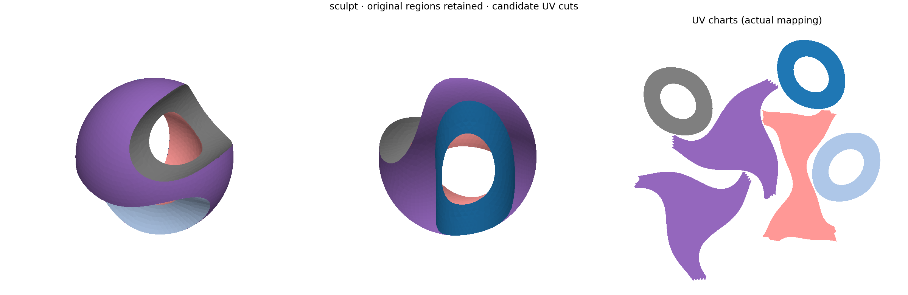
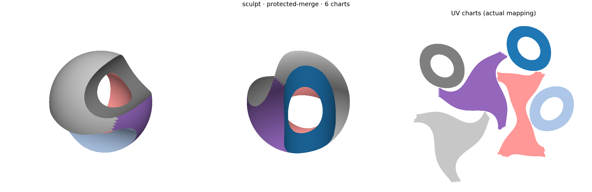
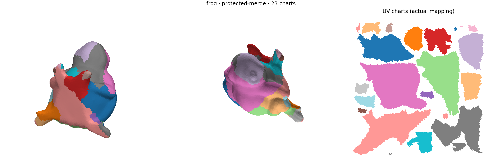

# Baseline-preserving regions and UV cuts

The offline candidate preserves sculpt's original **five semantic regions and
all 384 inter-region boundary edges** by construction. It produces six UV charts: four regions
unwrap whole after internal cuts, while one needs an additional quality-driven
split. This addresses losing a good segmentation during atlas construction.
It does **not** fix the rejected thickness segmentation or establish uniform
UV-quality superiority over xatlas.

This is [METHOD-045](../../tasks/active/METHOD-045-baseline-preserving-atlas-cuts.md),
directed by the operator after postponing runtime integration. The
[campaign record](../../ara/evidence/diagnostics/method045/record.json) and
ARA [C71/C72](../../ara/logic/claims.md#c71-baseline-regions-and-uv-cuts-can-remain-separate)
bind the local CPU observations. Production methods, defaults and editor menus
are unchanged. The older METHOD-042/043/044 results remain historical evidence.

## Sculpt: what is preserved and what changes

The old segmentation labels and the new UV chart IDs are different arrays.
An internal UV seam duplicates corners without changing a semantic region.
If a cut region still violates the distortion limit, UV subdivision is explicit;
the source triangle geometry and original region labels remain unchanged.





All rows below use the same freshly exported native source geometry. The two
prototype rows use the same UV-only xatlas packer, resolution 1024, padding 2
and default placement. Native xatlas is the existing end-to-end comparator,
with no imposed 1.35 stretch constraint.

| Sculpt output | UV charts | Lost original boundary edges | Maximum stretch | Area-weighted mean | Area-weighted p95 | Square texture occupancy |
| --- | ---: | ---: | ---: | ---: | ---: | ---: |
| Earlier feature/merge prototype | 5 | 63 | 1.3014 | 1.0708 | 1.1731 | 49.10% |
| Protected-region candidate | 6 | 0 | 1.2443 | 1.0487 | 1.1476 | 39.91% |
| Native xatlas | 17 | 0 | 1.2455 | 1.0214 | 1.0566 | 50.90% |

The new candidate improves the recorded distortion measures over the earlier
prototype while retaining all original borders. Native xatlas still has lower
mean and p95 distortion and better occupancy. Six charts instead of seventeen
does not establish a better atlas. New intra-region chart edges remain jagged.

Importable [sculpt OBJ](../../ara/evidence/diagnostics/method045/examples/sculpt/packed.obj)
and [frog OBJ](../../ara/evidence/diagnostics/method045/examples/frog/packed.obj)
have corner UVs and UV-chart groups; keep their neighboring MTL/checker PNGs.
The adjacent `result.npz` preserves both `region_labels` and UV `labels`, along
with exact source geometry and packed corner UVs. Semantic region colors are
shown separately above; OBJ chart groups are not replacement segmentation.

## Frog after the fix



The geometry is unchanged. Colored UV patches remain jagged and fragmented:
23 charts versus the [earlier prototype's 15](../../ara/evidence/diagnostics/method045/examples/frog/feature.png).
The [original five labels](../../ara/evidence/diagnostics/method045/examples/frog/regions.png)
are preserved, including all 55 boundary edges, but largely consist of one big
region plus tiny islands. This is not a clean head/body/leg segmentation.

| Frog output | UV charts | Lost original boundary edges | Mean stretch | Square occupancy |
| --- | ---: | ---: | ---: | ---: |
| Earlier feature/merge prototype | 15 | 41 | 1.0704 | 56.94% |
| Protected-region candidate | 23 | 0 | 1.0661 | 58.24% |

The small distortion and packing changes do not establish better visual parts.
Total normalized UV seam length increases from 9.3942 to 12.2433. These maps use
the same resolution 1024 and padding 2 settings as the sculpt comparison.

## Mechanism and rejected alternatives

The initial probe tried each original sculpt region directly with unchanged
LSCM. All five failed topology before distortion was tested: three have two
boundary loops and two have three. Replacing those regions with arbitrary
seeds would discard the baseline without addressing that topology.

The [reference](../../tools/diagnostics/atlas/baseline_atlas.py) instead:

1. Validates the source manifold and separates connected components within
   each supplied label. Label identity is independent of component count.
2. For a genus-zero region with boundary, connects its boundary loops by
   deterministic shortest primal-edge paths. Face-corner connectivity duplicates
   vertices across cuts; the resulting chart must pass the existing disk test.
3. Reuses the original LSCM solver, finite/orientation/simple-boundary checks,
   maximum area-normalized bidirectional stretch 1.35 and anisotropy 2.0.
4. Bisects an unsupported or rejected region explicitly. The corrected arm
   re-merges only subdivisions of the same original region, re-solving and
   revalidating each candidate union. It cannot cross protected region borders.
5. Packs the fixed chart UVs and independently recomputes distortion and
   positive-area intersections, including between charts, at the existing
   normalized numerical tolerance `1e-10`. Packed exports retain region labels.

This adapts the usual separation between a source surface and a cut parameterization
domain, described by [CGAL's seam-mesh documentation](https://doc.cgal.org/latest/Surface_mesh_parameterization/index.html),
using the existing [LSCM formulation](https://people.engr.tamu.edu/schaefer/teaching/689_Fall2006/p362-levy.pdf).
It is not a reproduction of CGAL or a new scientific method. No dependency is added
to the engine; the offline scripts use the existing NumPy/SciPy environment.

The cylinder control becomes one near-isometric chart after a cut. A flat annulus
is a retained negative: LSCM closes the slit in its planar solution, so the simple
boundary check rejects it and two UV charts are emitted for the unchanged region.
This does not rule out one chart with a different cut or solver.
Closed/higher-genus regions use explicit subdivision, not an unvalidated universal
cut-graph algorithm. A nonmanifold source is rejected before corner duplication.

The first split-only frog candidate produced 63 charts. Rejoining valid subdivisions
within each region reduces that to 23; this remains more than the earlier prototype's
15 charts. It preserves the baseline's tiny regions too, which may be unwanted for
an unconstrained atlas. Label preservation is a policy, not evidence that those
labels are anatomically correct or universally useful.

## Cohort and resolution controls

| Candidate input | Original regions | UV charts | Lost baseline edges | Maximum stretch | Mean stretch | Square occupancy |
| --- | ---: | ---: | ---: | ---: | ---: | ---: |
| Sculpt | 5 | 6 | 0 | 1.2443 | 1.0487 | 39.91% |
| Frog | 5 | 23 | 0 | 1.3494 | 1.0661 | 58.24% |
| Fandisk | 15 | 15 | 0 | 1.0286 | 1.0025 | 60.72% |
| Dolphin | 11 | 16 | 0 | 1.3454 | 1.0491 | 42.15% |
| Sculpt, fourfold subdivision | 5 | 6 | 0 | 1.2457 | 1.0464 | 37.57% |
| Frog, fourfold subdivision | 5 | 25 | 0 | 1.3449 | 1.0770 | 46.19% |

All six candidate maps pass the recorded post-pack checks. The changed frog
partition and occupancy reject resolution-invariance claims. Subdivision
preserves the same piecewise-linear surface and is not arbitrary remeshing.
Fandisk needs no extra inter-chart edges relative to its baseline. Dolphin is
an additional smooth control chosen after bunny10k's native curvature baseline
rejected `invalid_topology`; bunny's missing labels are retained as an execution
error, not fabricated or silently replaced. The comparison does not diagnose
that source rejection or override it with repair.

The stretch bounds are **per-chart area normalized**. They exclude differences
in texel density between charts; `chart_texel_density_ratio` reports that
separately (about 1.12 for the candidate dolphin). Native integer extent
expansion can also change density, so all limits are rechecked after packing.

The shared `all_charts_valid` flag checks numerical UV orientation,
nondegeneracy and overlap. Disk topology is a separate `non_disk_charts` field;
construction requires disks for this candidate, while native xatlas can have a
non-disk chart that still passes the shared numerical checks.

## Packing is a separate outcome

A pack-only diagnostic exposes xatlas's existing exhaustive placement option.
The input UVs, region/chart labels, resolution and padding are frozen.

| Input | Default cropped occupancy | Exhaustive cropped occupancy | Default square occupancy | Exhaustive square occupancy |
| --- | ---: | ---: | ---: | ---: |
| Sculpt | 40.79% | 47.47% | 39.91% | 39.52% |
| Frog | 59.30% | 66.77% | 58.24% | 59.47% |

Both exhaustive outputs pass the same post-pack quality limits. Sculpt's more
elongated atlas explains why the cropped measure improves while the square
texture measure gets worse. The uniform-improvement prediction is refuted;
default packing remains unchanged. These are not speed measurements or a
packing-optimality result.

The original offline packer adapter keyed vertices only by source vertex and
chart ID, which welded internal cuts. The fix includes the corner UV in that
identity; a real native cylinder-packing regression verifies source-corner
correspondence, retained region labels and the internal seam.

Native packing can mirror a whole chart by swapping its UV axes. The audit
counts these as `global_chart_reflections`, accepts uniform chart orientation
and rejects mixed signs. A [saved-array check](../../ara/evidence/diagnostics/method045/verification/packed-orientation-audit.json)
confirms five mirrored sculpt charts and nine frog charts, with no mixed-or-zero
chart in the four candidate outputs. This is not a foldover or a guarantee of
orientation-preserving packing; the earlier Python shelf packer preserves winding.

## Collaboration, verification and remaining work

Claude supplied an [initial design review](../../ara/evidence/diagnostics/method045/reviews/claude-design.md)
and a [corrected review](../../ara/evidence/diagnostics/method045/reviews/claude-correction.md)
that accepted the distinction between the original five-region baseline and
the newer five-chart atlas. The second review recommended the topology probe
before building the integration. Codex implemented and ran the experiments.
After operator sharing approval, Claude completed a
[source/result review](../../ara/evidence/diagnostics/method045/reviews/claude-source.md)
of the new code and mesh-free aggregate measurements. It supported the inspected
preservation logic and requested clearer reflection, normalization and chart-count
reporting. The [resolution](../../ara/evidence/diagnostics/method045/reviews/resolution.md)
checks those points against source and retained arrays. Claude did not rerun the
experiments, inspect input geometry, or accept anatomical visual quality.

Verification: Clang 23 `ci` configure and `IntrinsicTests` build; full CPU gate
4308 selected entries, zero failures and one environment skip; 9 new standalone
tests and 11 existing atlas tests, including native adapters, pass. Final focused
atlas/parameterization CTest and structural/manifest/result validation are recorded
under [verification](../../ara/evidence/diagnostics/method045/verification/).
Thirty diagnostic cells validate against one stable benchmark identity; these
remain dirty-source, non-publication-grade observations. The manifest was
consolidated after the initial probe, so the campaign is exploratory.

Keep this as a protected-region candidate, not a new production default. Remaining
work includes local movement of additional UV cuts without weakening original
region borders, better packing/compactness tradeoffs, arbitrary-remeshing and
larger-mesh tests, and a native implementation with shared runtime/config/UI
publication. METHOD-044 still owns adoption. METHOD-043's thickness/anatomical
segmentation failures remain unresolved; this work does not hide them behind
returning an old baseline.

## Subsequent stage audit

The [2026-09-08 stage inspection](atlas_stage_inspection.md) exposes initial
clusters, observed split/merge decisions and unused curvature signals. It
localizes boundary loss without changing these candidate outputs.

## Replay

The retained native geometry exports are compressed JSON. Decompress the desired
`*.geometry.json.gz` and copy its neighboring `*.labels` to a local baseline
directory. The paired arrays provide exact source-face correspondence.

```bash
cmake --preset ci
cmake --build --preset ci --target IntrinsicUvAtlasMeshDiagnostic IntrinsicUvChartPackDiagnostic
OPENBLAS_NUM_THREADS=1 python3 tools/diagnostics/atlas/baseline_atlas.py /tmp/baselines/sculpt /tmp/sculpt-atlas/protected --merge
OPENBLAS_NUM_THREADS=1 python3 tools/diagnostics/atlas/repack.py /tmp/sculpt-atlas/protected.npz /tmp/sculpt-atlas/packed.json
OPENBLAS_NUM_THREADS=1 python3 tools/diagnostics/atlas/compare_baseline_atlases.py /tmp/baselines /tmp/baseline-comparison --meshes sculpt frog --arms protected-merge feature xatlas
OPENBLAS_NUM_THREADS=1 INTRINSIC_TEST_NATIVE_ATLAS=1 python3 tests/regression/tooling/Test.BaselineAtlas.py
```

Use a fresh comparison directory to preserve earlier cells. `--subdivide` enables
same-surface controls; `repack.py --brute-force` selects the separate exhaustive
packing probe. Outputs report requested bounds and actual post-pack validity.
