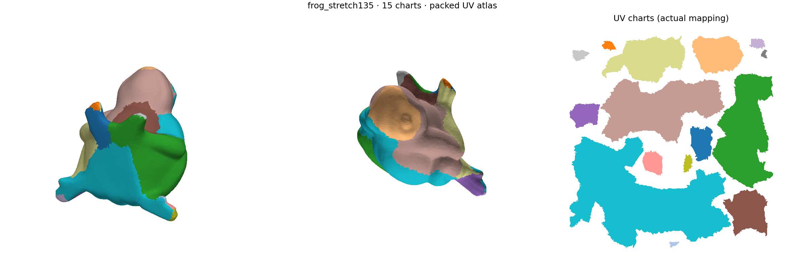
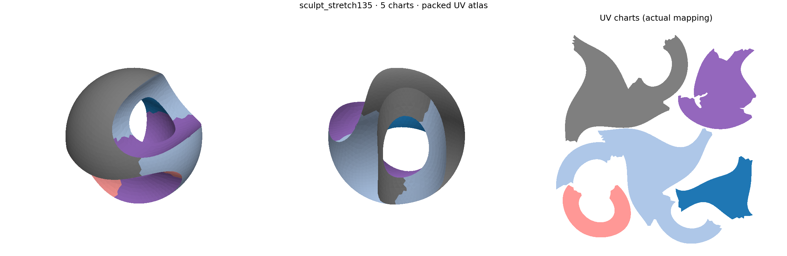

# Feature-aware patches → distortion-aware atlas charts

The classical two-stage approach is promising enough to continue. It produces actual usable UV maps, not just segmentation colors, on frog, sculpt and two held-out meshes. It is **not yet a production backend or a proven native speed improvement**. The principal remaining issues are jagged/seed-dependent boundaries and mediocre packing efficiency.

This is the operator-directed [METHOD-044 experiment](../../tasks/active/METHOD-044-feature-aware-atlas-merge-experiment.md), developed with actual Claude CLI design, iteration and source/result reviews. The [campaign record](../../ara/evidence/diagnostics/method044/record.json), [iteration notes](../../ara/evidence/diagnostics/method044/iteration-notes.md) and ARA [C69/C70](../../ara/logic/claims.md#c69-bounded-classical-atlas-patch-and-merge-diagnostic) bind the bounded CPU observations. No deep learning, anatomical labels, production defaults or existing METHOD-039–043 algorithms were changed.

## Results to inspect

These examples use the intermediate **1.35 stretch limit**, followed by xatlas used **only as a packer**. They are not the minimum-chart operating point.

| Mesh | Faces | Charts | Maximum stretch | Area-weighted mean | Area-weighted 95th percentile |
| --- | ---: | ---: | ---: | ---: | ---: |
| Frog | 19,106 | 15 | 1.347 | 1.070 | 1.180 |
| Sculpt | 7,342 | 5 | 1.301 | 1.071 | 1.173 |





Importable, source-derived OBJ examples: [frog](../../ara/evidence/diagnostics/method044/examples/frog_stretch135_final/packed.obj), [sculpt](../../ara/evidence/diagnostics/method044/examples/sculpt_stretch135_final/packed.obj). Keep each OBJ beside its supplied MTL and checker PNG. The source triangle geometry is unchanged; per-corner UVs and chart groups are added. The neighboring NPZ contains the numeric source-face labels and UV arrays. This is an offline export, not ECS/UI publication.

### What “stretch” means here

For each chart, uniformly rescale UV area to match its 3D area. For each triangle's 3D-to-UV Jacobian, with singular values `s_max ≥ s_min`, measure `max(s_max, 1/s_min)`. Thus 1 is isometric, and 1.35 bounds both expansion and inverse compression in the tested map. This is **not** a percentage of bad triangles or the engine's differently named distortion fields. Anisotropy `s_max/s_min` has a separate limit of 2.

Every accepted union must be a connected manifold disk, including single-fan vertex links, and have finite, consistently oriented UV triangles, a simple boundary and acceptable distortion. A separate final audit recomputes singular values through the metric tensor and tests positive-area triangle intersections, including between packed charts, at normalized tolerance `1e-10`. Whole-chart reflection from the packer is allowed; mixed orientation/foldovers are not. These are numerical checks, not exact-predicate certification.

Per-chart normalization intentionally removes uniform texel-density differences. The displayed packed examples separately measure maximum/minimum chart density ratios of approximately 1.015 and 1.001. Continuous UV occupancy is about 59.5% for frog and 51.2% for sculpt: useful output, but packing remains a weakness. Raster utilization, which includes additional raster coverage, is recorded separately and is not substituted for occupied UV area.

Those occupancy values use the native packer's cropped rectangular bounds. The exported checker demonstration uses uniformly scaled UVs in a square texture, so its effective square-texture occupancy is slightly lower.

## Comparisons and controls

The frozen initial cohort uses 64 geometric seed locations, feature weight 2 and stretch limit 1.5. “Feature” here means a soft integrated normal-turn cost on the triangle dual graph—not an extracted ridge/valley curve network or a learned semantic descriptor.

| Mesh | Feature growth + merge ordering | Fully feature-blind | xatlas default |
| --- | ---: | ---: | --- |
| Frog | 12 charts | 16 charts | 26 charts |
| Sculpt | 5 | 8 | 17 |
| Bunny10k | 18 | 23 | Validity failure; not used for a quality-win claim |
| Fandisk | 5 | 8 | 15 |

Fewer charts are not automatically better. On frog, xatlas's maximum/mean stretch is about 1.858/1.048; on sculpt it is 1.245/1.021. Our larger charts generally trade higher average stretch for fewer/shorter seams. At the tighter 1.25 limit, packed frog/sculpt use 23/8 charts with maximum stretch about 1.242/1.221. This is an operating-point comparison, **not** a matched-mean-distortion or Pareto-dominance result. No direct D-Charts implementation was tested.

The native adapter uses the public `Geometry.UvAtlas` API, authored hints disabled, fallback disabled, resolution 1024 and padding 2. The initial frog audit mistakenly excluded a non-disk native chart; direct intersection checks show that chart is usable and its distortion is now included. Native bunny10k returns success but includes an invalid chart ID/UV mapping and two detected intersections. That negative cell is retained, not repaired or silently excluded from the record.

Uniform fourfold subdivision of the **same piecewise-linear surface** changes frog from 12 to 13 charts and sculpt from 5 to 6; maximum stretch remains within 1.5 before and after packing. Normalized seam lengths change from 9.214 to 8.515 and 6.071 to 6.572. This is bounded evidence of usability at two resolutions, not exact partition invariance or robustness to arbitrary remeshing. The 15 generated controls cover three samplings each of folded sheets, cut cylinders, circumferential cylinders, planar annuli and spheres. Fold/cut-cylinder maps become one near-isometric chart; annuli require cuts/multiple disk charts; the sampled spheres use 2–4 charts.

### Which feature stage helps?

The fourth round isolates the two feature uses without changing seeds or quality gates:

| Feature use | Frog | Sculpt | Bunny10k | Fandisk |
| --- | ---: | ---: | ---: | ---: |
| None | 16 | 8 | 23 | 8 |
| Growth only | 14 | 5 | 16 | 4 |
| Merge ordering only | 13 | 8 | 23 | 8 |
| Both | 12 | 5 | 18 | 5 |

Feature-aware initialization is the useful component to retain, especially on sculpt/fandisk. The extra merge-order feature term does not consistently help: growth-only also has shorter seams on sculpt, bunny and fandisk. Frog is mixed, so neither variant should be advertised as universally best. The exported 1.35 examples use the tested “both” configuration; the ablation is not silently substituted into those results.

## Implementation and cost

The construction adapts established ideas rather than claiming a new algorithm:
[Lévy et al.'s LSCM atlas pipeline](https://people.engr.tamu.edu/schaefer/teaching/689_Fall2006/p362-levy.pdf),
[Sander et al.'s adjacent chart merging](https://cs.harvard.edu/~sjg/papers/tmpm.pdf),
and [feature-aware oversegmentation](https://link.springer.com/content/pdf/10.1007/s41095-016-0071-3.pdf).
Our actual UV solve per candidate merge is not a reproduction of Sander's geometric merge proxy; no correlation-clustering optimizer is implemented.

1. Normalize geometry by square-root surface area and build oriented dual adjacency.
2. Choose geometric farthest-point seeds; assign connected patches by multi-source Dijkstra with edge cost `distance + feature_weight × patch_scale × normal_turn`.
3. Split initial patches that fail topology/LSCM quality.
4. Rank adjacent unions by shared seam removed relative to patch size, optionally with a soft feature penalty. Accept only after an actual LSCM solve and validity/distortion checks. Invalidate only affected adjacency entries.
5. Pack frozen chart UVs through xatlas's UV-only API; verify chart/corner correspondence and audit the **post-pack** maps.

The [CPU reference](../../tools/diagnostics/atlas/patch_merge.py) uses NumPy/SciPy. Scalar topology traversal dominated the first profile; vectorizing edge incidence and face-corner connectivity preserved frog/sculpt labels, UVs and accept/reject decisions. Actual UV solves and factorized degrees of freedom are now distinguished from topology-rejected parameterization attempts.

Single-sample resident-input timings for the frozen 1.5 feature arm were approximately 2.74 s frog, 0.85 s sculpt, 1.54 s bunny and 1.80 s fandisk, plus roughly 0.5 s for native packing on the original meshes. **These are local diagnostic costs, not end-to-end application latency or a speedup claim**: independent auditing, process/JSON traffic, rendering and export are excluded; some runs overlapped other local work. The comparator is a Clang 23 `ci` Debug engine adapter, not a matched optimized implementation. The [manifest](../../benchmarks/geometry/manifests/geometry_uv_atlas_patch_merge_diagnostic.yaml) and canonical schema-v2 cells retain that non-claim-eligible status. The manifest was consolidated during the campaign; these are exploratory cells, not a preregistered performance study.

## Reproduce

Verification recorded 11 standalone diagnostic tests, 4308 full CPU CTest entries (zero failures, six skips), and 90 final focused atlas/parameterization entries (zero failures). Task/ARA/manifest/result/layout/link checks pass. The unrelated strict root-hygiene check flags the local `.agents/` directory; [BUG-177](../../tasks/backlog/bugs/BUG-177-root-hygiene-local-agent-metadata.md) tracks that finding without altering the directory or weakening the gate.

Offline Python dependencies: NumPy, SciPy, Matplotlib; Trimesh additionally for generated controls/subdivision. They are not new engine/vcpkg dependencies. The native tools reuse the repository's existing xatlas dependency.

```bash
cmake --preset ci
cmake --build --preset ci --target IntrinsicUvAtlasMeshDiagnostic IntrinsicUvChartPackDiagnostic
OPENBLAS_NUM_THREADS=1 MPLCONFIGDIR=/tmp/atlas-mpl python3 tools/diagnostics/atlas/compare_atlases.py /home/alex/Dropbox/Work/Datasets/obj/frog.obj /tmp/atlas-replay/frog --stretch-limit 1.35 --arms feature
OPENBLAS_NUM_THREADS=1 MPLCONFIGDIR=/tmp/atlas-mpl python3 tools/diagnostics/atlas/repack.py /tmp/atlas-replay/frog/feature.npz /tmp/atlas-replay/frog-packed/packed.json
OPENBLAS_NUM_THREADS=1 python3 tools/diagnostics/atlas/controls.py /tmp/atlas-replay/controls.json
OPENBLAS_NUM_THREADS=1 MPLCONFIGDIR=/tmp/atlas-mpl INTRINSIC_TEST_NATIVE_ATLAS=1 python3 tests/regression/tooling/Test.AtlasPatchMerge.py
```

Use `--arms feature blind growth-only merge-only xatlas` for the ablation/native comparison and `--subdivide 1` for same-surface resolution checks. Invalid/degenerate/non-triangular input is not automatically repaired. Retained source hashes identify the local external OBJ versions.

## Decision and remaining work

Claude's [final focused source/evidence review](../../ara/evidence/diagnostics/method044/reviews/atlas-final-claude-focused.md) found no blocking error in the shown numerical/topology/audit code and recommended retaining the two-stage direction. The larger full-source request timed out; this is not presented as a full independent repository audit. The normalization question in that review was checked directly: `geometry` divides every face area by total area. The pinned NumPy/SciPy versions are in the campaign record.

Continue with **feature-aware connected initialization + distortion-validated merging**. It is better aligned with the atlas objective than the earlier thickness/anatomical parts experiments. Do not add expensive full crease-curve reconstruction until it fixes a demonstrated failure.

Before production adoption: port the bounded reference to the existing geometry numerical infrastructure; measure a matched Release/native cohort including all required validation/packing; add arbitrary-remeshing/large-mesh controls; and evaluate local boundary moves or a packing/compactness term to address jagged seams and empty atlas space. Greedy merge-only atoms cannot relocate every bad initial cut, and repeated large union solves have no proven near-linear worst-case bound. A global direct-growth/optimization comparison remains open. Native/config/UI/publication follow-ups remain owned by METHOD-044; GEOM-076 is not silently declared complete.


The [baseline-preserving continuation](baseline_preserving_atlas_experiment.md)
(METHOD-045) investigates preserving existing region boundaries with internal UV
cuts. It retains the earlier campaign above and does not promote a backend.
