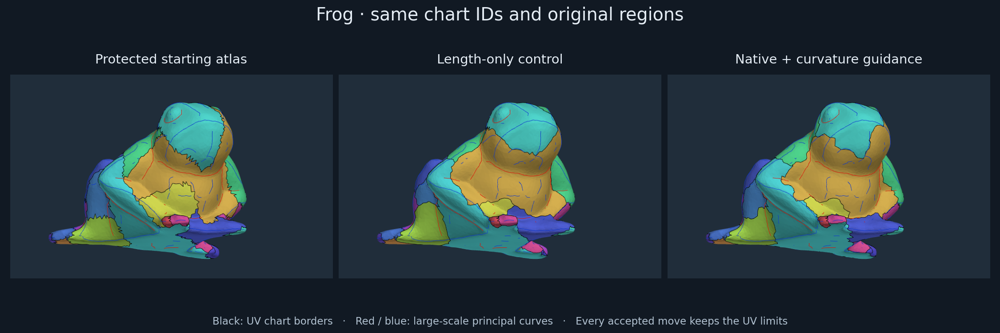
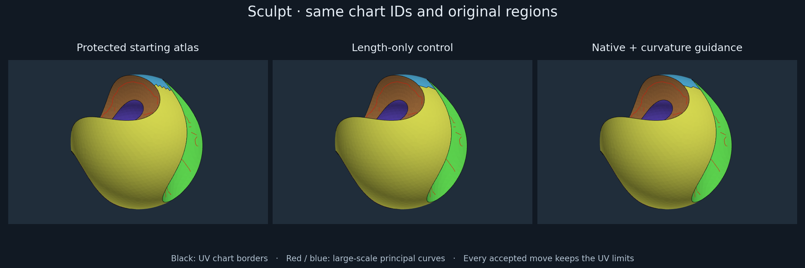

# Feature-guided UV boundary relocation

METHOD-046 implements an offline boundary-refinement candidate planned and reviewed
with Claude. On the recorded frog, additional seams become shorter and visibly
less jagged. Sculpt retains its original five regions, all 384 original border
edges, and its distortion quality. Guidance, chart area and packing still trade
off; this is not an anatomical segmentation result or a production default. The
bounded observations are recorded in C74 in the [claim ledger](../../ara/logic/claims.md).



## What changed

The [stage audit](atlas_stage_inspection.md) separated placement defects from
merge losses. This slice moves additional chart boundaries **after** the
[protected atlas](baseline_preserving_atlas_experiment.md). Source geometry and
semantic region labels remain immutable; UV chart IDs remain distinct.

Claude recommended a collective binary graph cut instead of moving one face at
a time. The discrete objective follows the edge-weighted Potts formulation in
[Boykov, Veksler and Zabih (2001)](https://www.cs.cornell.edu/~rdz/Papers/BVZ-PAMI01.pdf).
This is a constrained two-label adaptation, not their complete multi-label
algorithm or its approximation guarantee. The continuous alternative,
[Sharp and Crane's Variational Surface Cutting (2018)](https://www.cs.cmu.edu/~kmcrane/Projects/VariationalCuts/),
optimizes cut placement using a different distortion formulation. This experiment
stays on mesh edges and checks explicit LSCM maps.

For a seam edge, the cost is `length * (1 - beta * support)`, with beta 0.8 and
support in [0,1]. A positive cost floor prevents noisy evidence from making seams
free. Candidate moves use a six-dual-hop band around an **initial** same-region
chart-pair seam. Original chart interiors deeper than six hops from every initial
seam stay fixed globally. A chart without such an interior is frozen as a whole.
Existing hard-feature seam endpoints also stay fixed. This limits cumulative
drift and prevents chart disappearance without introducing an area penalty.

Each initial adjacent pair is visited in descending initial shared length, with
chart IDs breaking ties, for at most three rounds. A rounded integer-capacity
minimum cut proposes a collective reassignment. The code then:

1. Requires strict decrease in the floating border surrogate.
2. Checks connectivity and the existing cut/open-region topology contract.
3. Re-solves both charts and requires a simple UV boundary, consistent orientation,
   maximum per-chart area-normalized bidirectional stretch ≤ 1.35 and anisotropy ≤ 2.
4. Requires strict decrease in the full weighted seam cost, including internal UV
   cuts, and retention of initially present hard seams.

Rejected pairs are cached by both chart revisions. Records identify the failed
chart, proposed area ratios relative to the initial charts, and moved faces
adjacent to fixed faces. This is monotone descent under a restricted proposal
rule; it does not solve the complete constrained problem optimally.

No cluster center needs moving for this operation. Initial seed selection and
protected merge ranking remain unchanged.

## Evidence used and controls

The frozen experiment uses the exact retained METHOD-045 frog/sculpt source,
regions and protected-merge chart labels. The five arms are the unchanged
reference, length-only, native-soft guidance, max(native-soft, curve guidance),
and that combined field randomly permuted with seed 20260908. Packing uses the
same native xatlas UV-only adapter, resolution 1024 and padding 2.

Native confidence binds by source edge. Curve support uses principal ridge/valley
segments at detector scale 2 on both meshes, their recorded support radius,
confidence, tangent agreement and distance falloff. Paths start at each segment's
source face and follow surface adjacency; nearby disconnected sheets cannot
contribute. Outside that face, the distance is a conservative center-path proxy.
Tangents are compared in ambient coordinates, without parallel transport.

The curve-support statistic is the length-weighted score on additional seams,
including internal cuts. It is also an optimization input, so it is **not** an
independent alignment or anatomical oracle. One shuffled realization is a control,
not a statistical significance test. Raw k1/k2, curve strength, sharpness,
residual and persistence remain available in the earlier inspection bundle;
this new solver does not invent a separate acceptance rule for every scalar.

## Matched results

Lengths are divided by the square root of total source area. “Extra length”
includes internal UV cuts and excludes immutable original region borders.
Stretch is measured after native packing. Square occupancy is independently
recomputed from packed triangle areas; it differs from cropped rectangular
utilization.

| Mesh | Arm | Accepted moves | Changed faces | Extra length | Curve support | Max stretch | Square occupancy |
| --- | --- | ---: | ---: | ---: | ---: | ---: | ---: |
| frog | reference | 0 | 0 | 11.7664 | 0.1084 | 1.349355 | 58.24% |
| frog | length | 41 | 2131 | 8.7822 | 0.1148 | 1.346360 | 58.32% |
| frog | native | 38 | 2273 | 9.3273 | 0.1134 | 1.342419 | 56.07% |
| frog | curves | 38 | 2229 | 9.2464 | 0.1330 | 1.349533 | 59.57% |
| frog | shuffled | 46 | 2181 | 9.3110 | 0.1094 | 1.337536 | 63.67% |
| sculpt | reference | 0 | 0 | 0.9412 | 0.0190 | 1.244345 | 39.91% |
| sculpt | length | 1 | 12 | 0.7658 | 0.0237 | 1.244345 | 39.19% |
| sculpt | native | 1 | 12 | 0.7658 | 0.0237 | 1.244345 | 39.19% |
| sculpt | curves | 1 | 12 | 0.7658 | 0.0237 | 1.244345 | 39.19% |
| sculpt | shuffled | 1 | 12 | 0.7669 | 0.0237 | 1.244345 | 36.47% |

All ten cells retain original regions, all 55 frog / 384 sculpt original border
edges, 23 frog / 6 sculpt charts, valid coverage and the stated UV limits. The
curve-guided arm shortens extra seams by 21.4% on frog and 18.6% on sculpt.

Frog's native arm has the lowest common guided energy, 6.795892 versus 6.831836
for combined guidance. Combined guidance has greater measured curve support and
better packing, but a higher maximum stretch. Plain shortening produces the
shortest seams and shrinks one chart to 14.35% of its initial area; the guided
arms' minimum ratio is 48.32%. Fixed cores prevent disappearance, not imbalance.
The shuffled arm packs best on frog. No arm dominates all these quantities.

Sculpt's length/native/curve outputs are identical: one twelve-face change along
an additional border. Its original semantic segmentation is unchanged. The
slightly worse packing is retained, rather than selecting a favorable placement
or claiming uniform baseline-quality improvement.



## Review and verification

Actual [Claude planning](../../ara/evidence/diagnostics/method046/reviews/plan.md)
preceded implementation. Its [source/result review](../../ara/evidence/diagnostics/method046/reviews/review.md)
found no refinement-core blocker and requested better diagnostics and numerical
tests. The [resolution](../../ara/evidence/diagnostics/method046/reviews/resolution.md)
records implemented fixes and disagreements with unsupported interpretations.
Claude received source and mesh-free aggregates; its review was not an independent
rerun or visual anatomical acceptance.

The initial frog attempt exposed consumption of a pair-local core by a later
pair. Global cores fix this, with a three-chart invariant regression. Internal
cuts are checked at both endpoints and reconciled against corner-UV discontinuities.
A folded sheet with a known crease tests relocation independently: guided moves
reach the crease, while length-only leaves the offset seam unchanged.

Verification: 12 new Python controls, 10 existing protected-atlas controls with
native packing, all 10 packed cohort cells, and exact post-review replay of every
label, UV and accepted stage. Clang 23 `ci` configured and built `IntrinsicTests`
and the packer. Focused CTest: 136 entries, zero failures. Full CPU gate: 4308
entries, zero failures, one expected unsanitized leak-check skip. All 185 viewer
modes rendered without WebGL errors. No sanitizer or GPU-method result is claimed.

The [record](../../ara/evidence/diagnostics/method046/record.json) binds source,
inputs, arrays, canonical diagnostic results, negative attempts and reviews.
Dirty local results are not publication-claim-eligible. The numerical audits are
not exact-predicate certificates.

## Inspect and replay

A portable self-contained viewer is retained as
[viewer.html.gz](../../ara/evidence/diagnostics/method046/viewer.html.gz).
After pulling the repository, unpack and open it without rerunning the experiment:

```bash
gzip -dc ara/evidence/diagnostics/method046/viewer.html.gz > /tmp/intrinsic-atlas-refinement.html
xdg-open /tmp/intrinsic-atlas-refinement.html
```

The importable curve-guided examples are
[frog](../../ara/evidence/diagnostics/method046/examples/frog/packed.obj) and
[sculpt](../../ara/evidence/diagnostics/method046/examples/sculpt/packed.obj), each
with its neighboring material and checker texture.

The generated local viewer is `build/method046/verified/index.html`.
It contains every accepted boundary reassignment, final control/candidate
partitions and evidence-score fields. Black lines show chart borders; internal
cuts are accounted for numerically and in the packed UV maps. The neighboring
`frog/curves/packed.obj` and `sculpt/curves/packed.obj` are importable examples.

```bash
OPENBLAS_NUM_THREADS=1 python3 tools/diagnostics/atlas/run_boundary_refinement.py frog build/method046-replay/frog
OPENBLAS_NUM_THREADS=1 python3 tools/diagnostics/atlas/run_boundary_refinement.py sculpt build/method046-replay/sculpt
python3 tools/diagnostics/atlas/inspect_boundary_refinement.py build/method046-replay
OPENBLAS_NUM_THREADS=1 python3 tests/regression/tooling/Test.AtlasBoundaryRefine.py
```

Anatomical acceptance, arbitrary remeshing, other support scales, chart-area
balance and independent optimization of internal cuts remain open. The offline
reference adds no selectable production backend or runtime/UI default.
[METHOD-044](../../tasks/active/METHOD-044-feature-aware-atlas-merge-experiment.md)
continues to own production adoption after quality acceptance.
