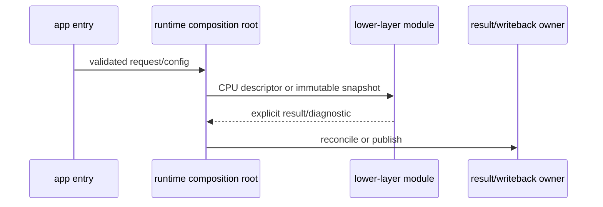

# IntrinsicEngine Architecture View Guide

## View selection

| Question | View | Evidence | Default budget |
| --- | --- | --- | --- |
| What is the engine's dependency shape? | Aggregated layer flowchart | `AGENTS.md` plus module graph | 15 nodes |
| Where does this module fit? | Module neighbourhood | Module `import` graph | 30 nodes, radius 1 |
| What changes if this surface changes? | Dependent neighbourhood | Reverse module imports | 30 nodes, radius 1 |
| Who composes this subsystem? | Composition flowchart | Runtime/app source sites | 20 nodes |
| What happens during one operation? | Sequence diagram | Concrete call sites | 8 participants, 20 messages |
| How does data change form? | Data-flow flowchart | Types, producers, consumers | 20 nodes |

Use the complete knowledge graph only as an interactive exploration surface.
Split a static view when it exceeds its budget.

## Output profiles

| Profile | Use | Visible structural evidence |
| --- | --- | --- |
| `audit` | Dependency inspection and review | Every selected edge; layer edges carry dependency, site, and violation counts |
| `presentation` | Explanation, docs, and handoff | Every selected module edge; layer counts move to comments and only violations retain labels |
| Focused `presentation` layer view | Explain one subsystem in whole-engine context | Every layer node; focus-incident edges plus all violations; omitted edges marked `visible=no` in comments |

Keep `audit` as the default and use presentation output as a projection over
the same evidence, never as a replacement for the complete audit view.

## Scale vocabulary

Use C4-style zooming without forcing C4 nouns onto the engine:

1. **Landscape:** IntrinsicEngine, users/tools, host platform, GPU/backend, and
   external asset or method inputs.
2. **Layer:** the exact `AGENTS.md` ownership layers.
3. **Module:** concrete exported C++23 module names and their import edges.
4. **Code neighbourhood:** only public types/functions needed to explain the
   selected seam.
5. **Behavior:** one independently evidenced runtime scenario.

Use `module`, not “component”; `runtime composition root`, not “service
container”; and concrete module names instead of subsystem nicknames.

## Structural conventions

- Draw dependency arrows from consumer to dependency: `A --> B` means A
  imports or otherwise depends on B.
- Group module nodes by their owning layer.
- Highlight the selected focus with a heavier border.
- In audit output, label aggregated layer edges with both module-dependency
  count and import-site count.
- In presentation output, move routine layer-edge counts into deterministic
  Mermaid comments and label only violations. When a layer focus filters
  visible edges, retain all layer nodes and record `visible=yes|no` for every
  aggregated edge.
- Use neutral context styling and one blue focus accent in presentation
  output. Preserve the layer palette in audit output.
- Use red edges only for a relationship that the graph tags as a violation;
  confirm it with the strict layering checker before reporting it as a defect.
- Put source provenance in Mermaid comments or accompanying prose rather than
  expanding every visible node label.

## Dynamic-view procedure

Before drawing a sequence or data-flow view:

1. Identify the user-visible scenario and its entry point.
2. Locate the app/runtime composition root.
3. Trace each called module in source; record the exact path and line.
4. Identify descriptor/snapshot ownership at every layer boundary.
5. Trace results, diagnostics, cancellation, writeback, and presentation.
6. Remove steps that do not affect the question.

Suggested sequence skeleton:

Replace every placeholder with a concrete file/module name. Do not show a
return or callback that source inspection did not establish.

## Evidence footer

Accompany a hand-authored view with:

- `Question:` what the diagram answers.
- `Scope:` included layers/modules and intentionally excluded detail.
- `Evidence:` repository-relative source and doc paths with line numbers.
- `Notation:` arrow meaning and dashed/colored edge meaning.
- `Blind spots:` static-import, include, runtime, generated-code, or backend
  limitations that apply.
